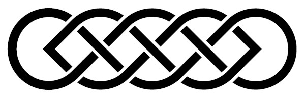
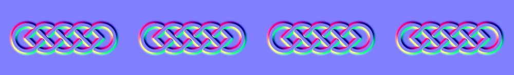
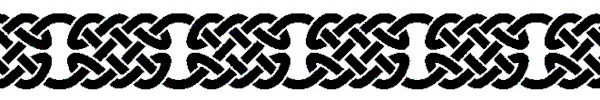
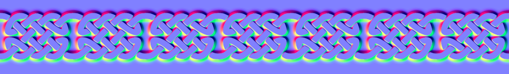
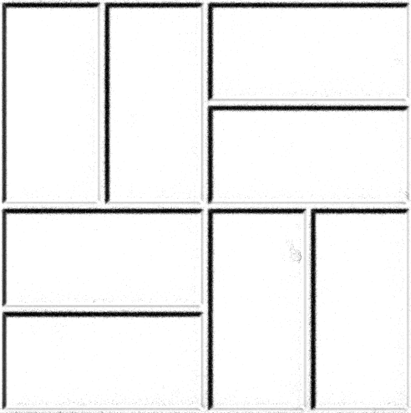
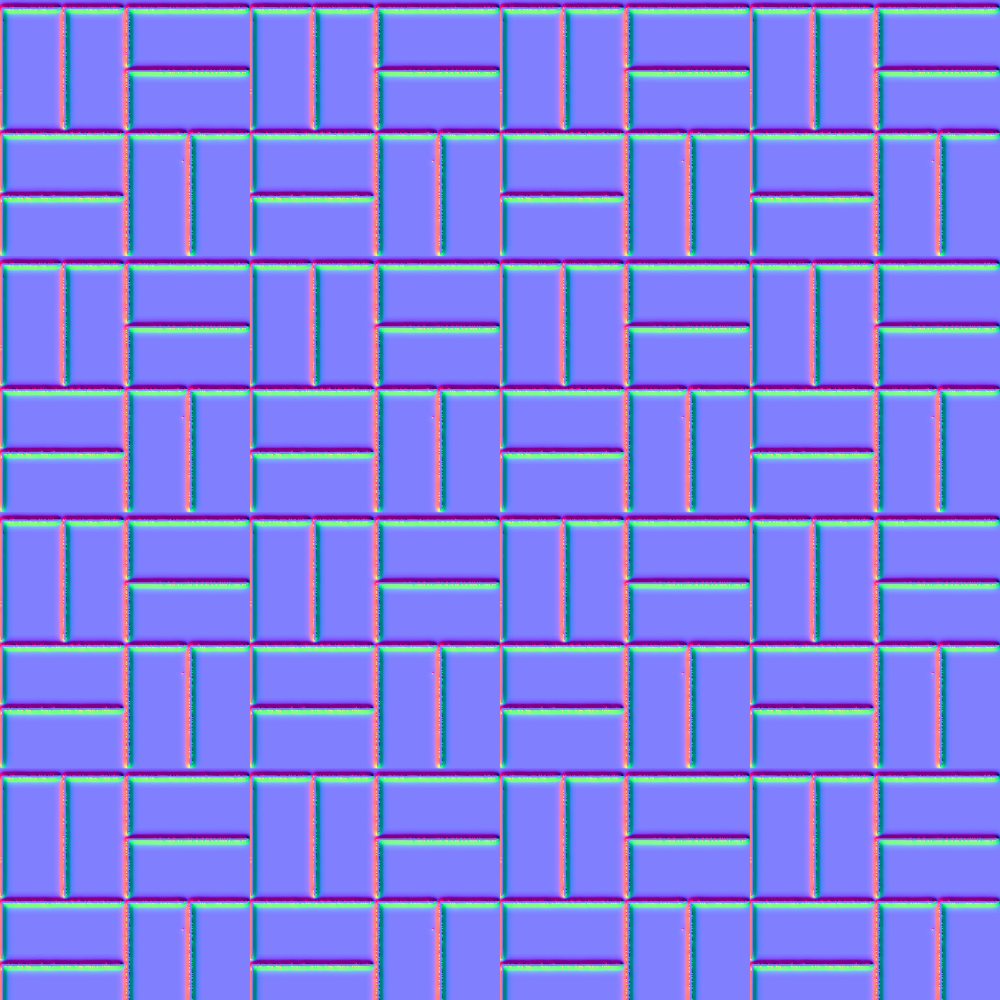

# Tileable Normal Map Generator

This project provides a tool for creating tileable normal maps from black and white images. The code processes the image to generate a normal map, which is then converted to SVG format, ensuring high quality and scalability even when resized. Ideal for applications that require detailed, high-resolution textures and scalable assets.

| Input | Output |
| -- | -- |
|  |  |
|  |  |
|  |  |

## Quick Start

```
git clone https://github.com/iacoposk8/Tileable-Normal-Map-Generator
cd Tileable-Normal-Map-Generator
pip install blend-modes
python NormalGenerator.py
```

## Settings

Inside NormalGenerator.py there are 3 examples of how to use N.img2normal that you can modify.

- **The first parameter** is the image we want to convert into a normal map.
- `tiles`
  - `from` number of tiles present in the input image
  - `to` number of tiles desired in the final image
  - **optional**
  - `2d` set to True if you want the tiles to repeat on both the x and y axis. Otherwise it will only be on the x axis
  - `padding` space in px between tiles
  - `offset` I don't remember :D but I seem to remember that it was set to 0.5 for input images that started with half a tile at the left point and set to 0 when the image started with a full tile. I did some tests but the result doesn't change

- **Optional but recommended:**
  - `normal_strength` is the depth with which the path will be etched into the normal map (Low number high incision).
  - `blur` is the width and consequently the softness with which the path will be applied to the normal map (Low number hard curves).
  - `invert` can be set to `True` for a convex map or `False` for a concave map

- **Optional:**
  - `size` is the width and height of the produced image.
